Praktikum

1. Menambahkan database dalam env
   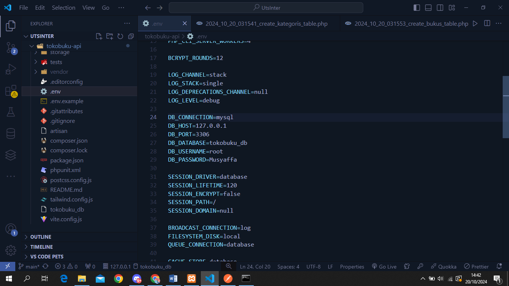
2. Membuat Model dan Migrate
   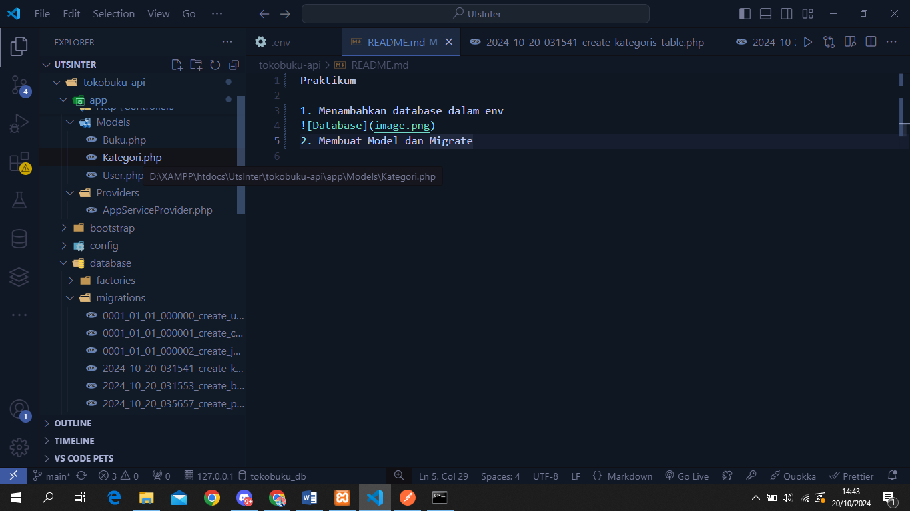
3. Mengisi Table Kategoris dan bukus

Kategoris:
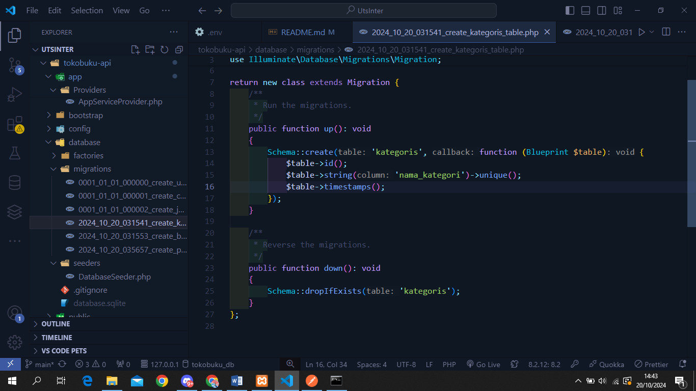

Bukus:
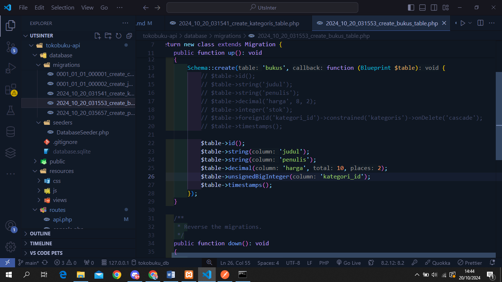

4. Membuat Buku dan Kategoris Controller dan Mengisi Controller

Kategoris:
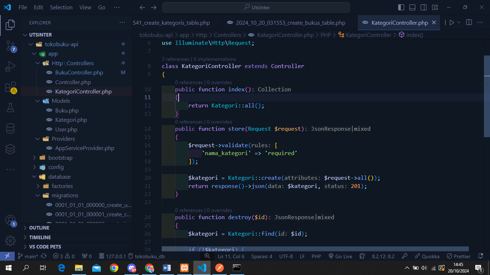

Bukus:
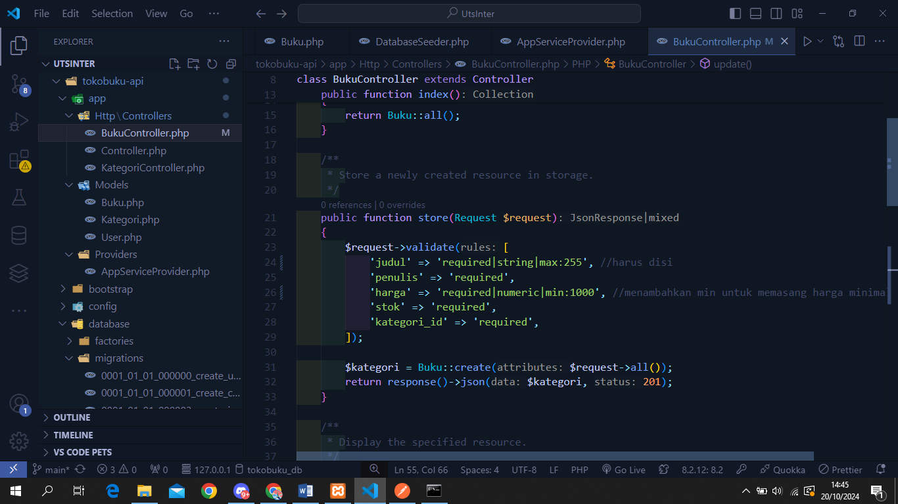

5. Lalu menambahkan api.php dengan cara "php artisan install:api" agar config otomatis terinstall

Menambahkan Route Buku dan Kategori:
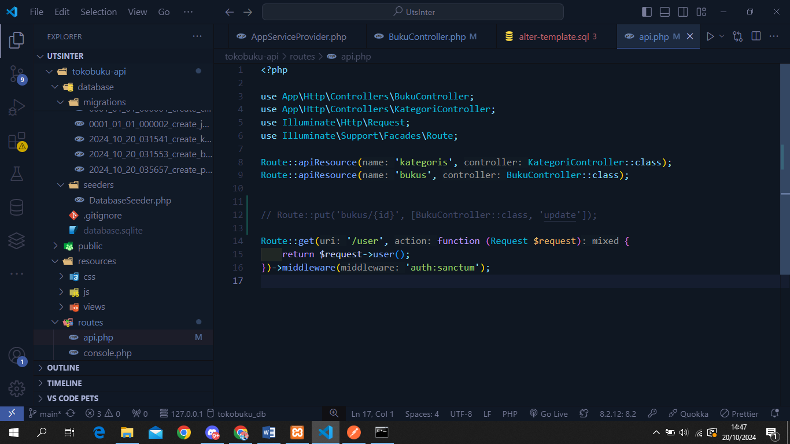

6. Mem-post dan melihat hasil dari kategoris

Hasil dari POST dan Melihat dengan GET:
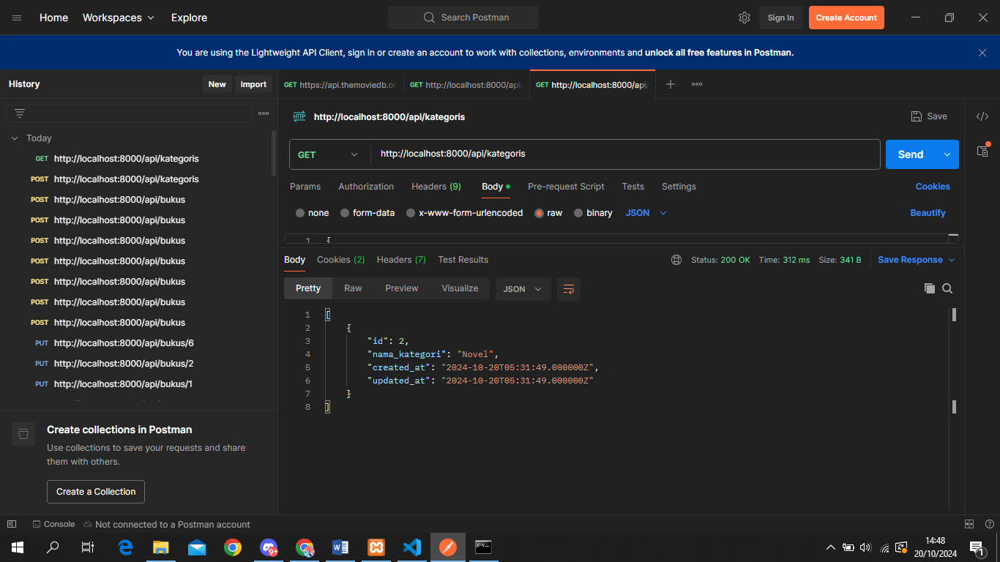

7. Menambah dan Melihat hasil dari bukus
   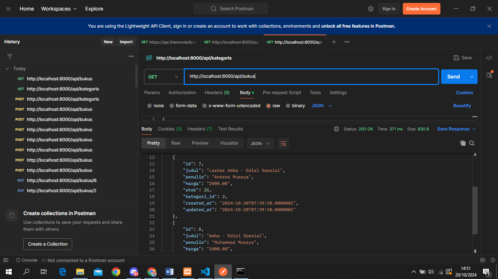
   \*ketika menambahkan buku, id dari ketagori harus sama

TUGAS UTS

1. Validasi:
   Nama Buku tidak boleh kosong dan Harga minimal 1000:
   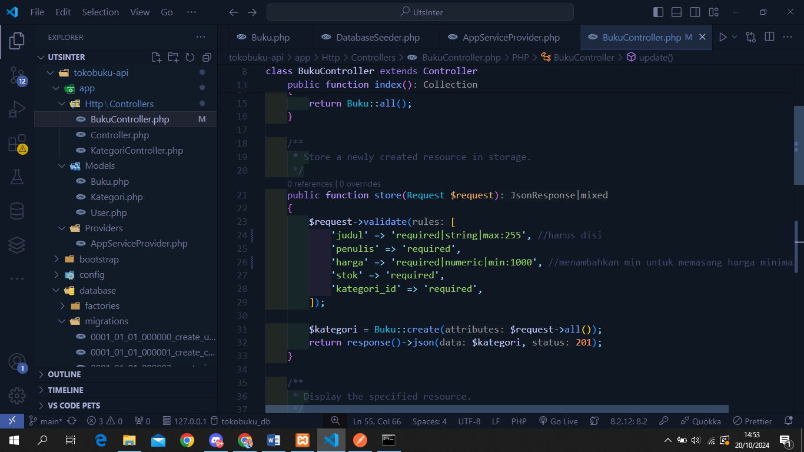
2. Filter
   Menambahkan kedalam Model Buku dan Kategori

    Kategori:
    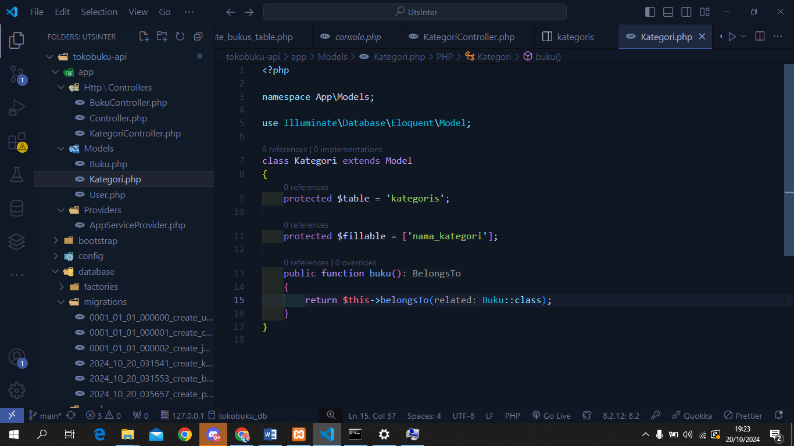

    Buku:
    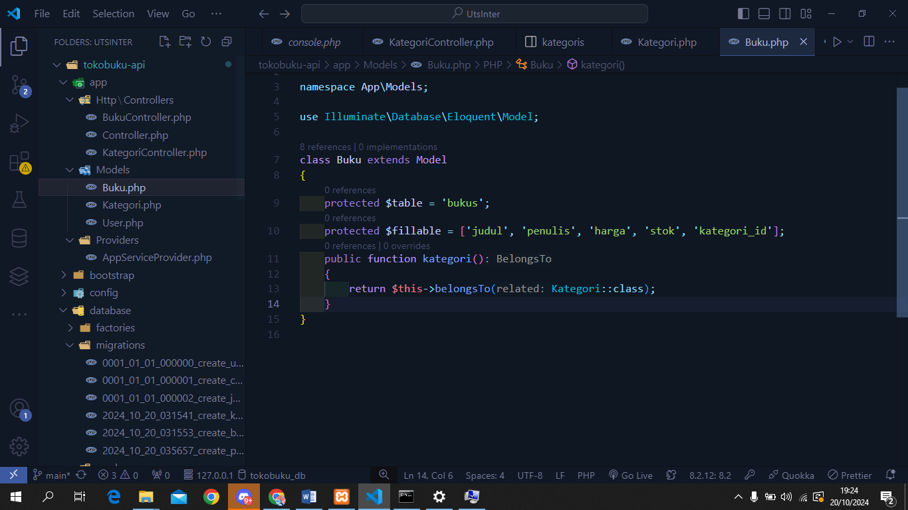

    Hasil Kategori buku Sains:
    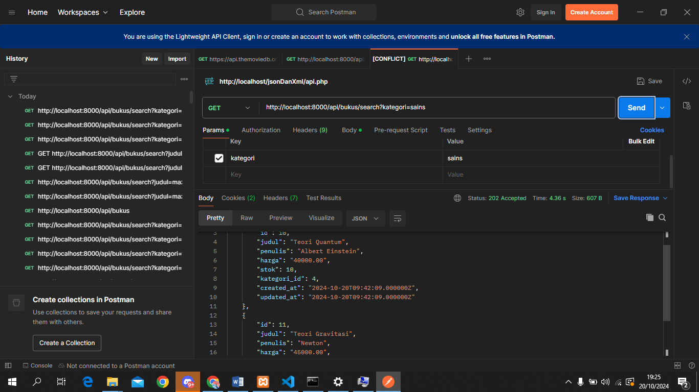

    Kategori Novel:
    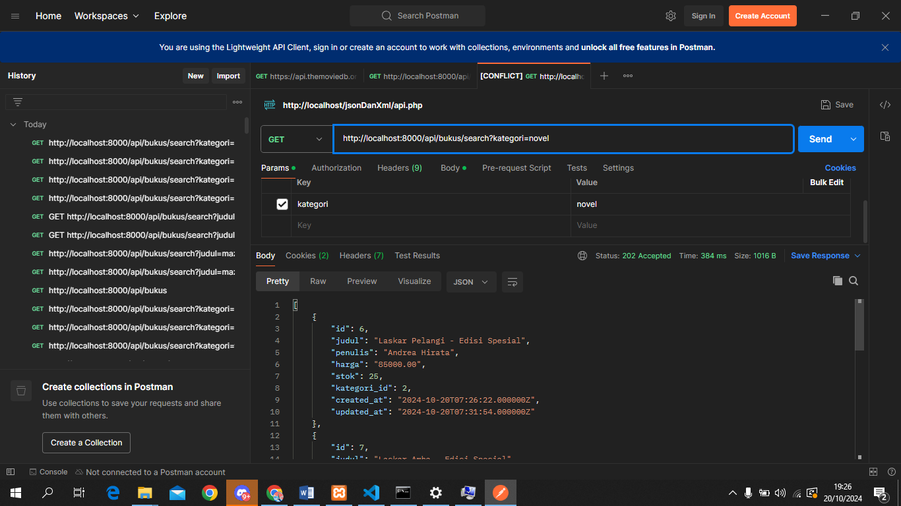

3. Upload Public API Ngrok

Menjalankan Aplikasi dari ngrok secara bersamaan menjalankan 'php artisan serve'

Hasil:
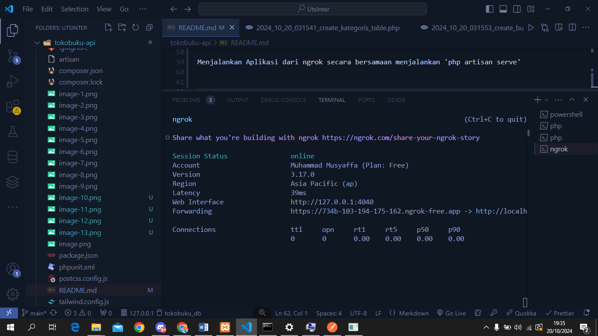
